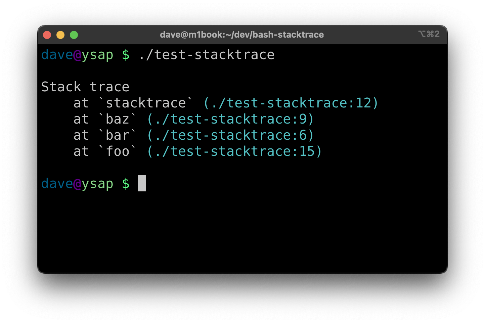

bash-stacktrace
===============

Construct and print a stack trace in bash



Usage
-----

Copy [stacktrace.bash](/stacktrace.bash) into your project, source it, and then
use the defined `stacktrace` function:

``` bash
#!/usr/bin/env bash

. ./stacktrace

# print a stack trace to stdout
stacktrace
```

Options
-------

    stacktrace [-C always|never|auto]

- `-C <always|never|auto>` Enable or disable color output, default is `auto`

License
-------

MIT License
